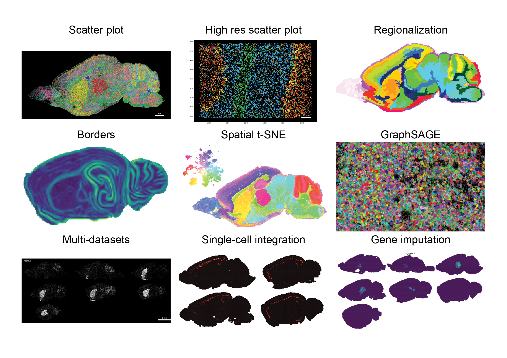

# FISHscale

> *Everything that glitters ain't fishscale*
> 
> <cite>*-- MF Doom - Figaro, Album: Madvillain*</cite>

Software package for the visualization, exploration and analysis of point based spatial transcriptomics data. FISHscale can load single or multiple datasets.  

# Gallery
### Visualization


### Analysis
  

# Getting started

The following instructions should work for Linux and Mac, and probably also Windows.

In a fresh Anaconda environment install FISHscale:
```
git clone https://github.com/linnarsson-lab/FISHscale.git
cd FISHscale
pip install -e .
```
You can download all data realated to the EEL FISH paper from [FigShare](https://figshare.com/projects/Scalable_in_situ_single-cell_profiling_by_electrophoretic_capture_of_mRNA_using_EEL_FISH/143616) and use it as example data.  

Use the [single-dataset](https://github.com/linnarsson-lab/FISHscale/blob/master/example_notebooks/FISHscale_tutorial_single_dataset.ipynb) notebook to get started with single datasets.
  
If you want to use multiple datasets, use the [multi-dataset](https://github.com/linnarsson-lab/FISHscale/blob/master/example_notebooks/FISHscale_tutorial_multi_dataset.ipynb) notebook to get started with multi-dataset objects. 

### Linux and Open3D
If the visualizer does not open the window after calling `.visualize()`, please follow these steps:  
- Uninstall Open3D: `pip uninstall open3d`
- Build Open3D from source using these instructions: [Open3D](http://www.open3d.org/docs/release/compilation.html)
